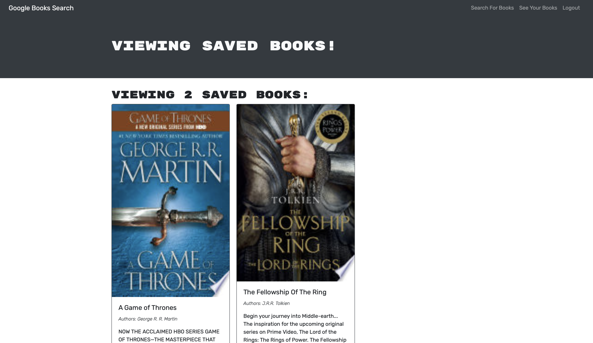

# Book Search 

## Description

Book Search is React application that leverages Google's Book API. Book Search is a full stack application that uses Express, MongoDB, Mongoose, and GraphQL

## Table of Contents 

- [Installation](#Installation)
- [Usage](#Usage)
- [Credits](#Credits)
- [License](#License)

## Installation

N/A

## Usage

When you visit Book Search, you are immediately able to search for books. If you would like to save a searched book to your own list, you can either sign in or sign up if you do not have an account. Visit the deployed application here: https://books-searches.herokuapp.com/

Example of the deloyed application:

## Credits

N/A 

## License

See LICENSE above